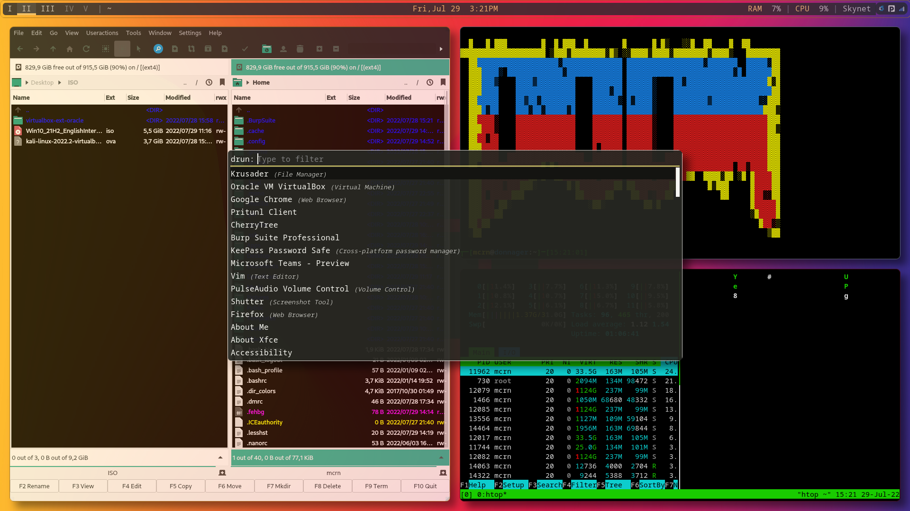
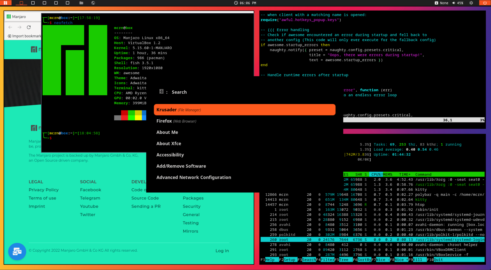

# Raas

---
## Manjaro 21.3.5

## Setup
make sure ur in the right directory "~/"

| Stuff | Raased |
|---------------------------|-------------------------|
| Window Manager | awesomeWM |
| Taskbar | Polybar |
| Compositor  | Picom |
| Lockscreen | i3 lock |
| Window switch/launcher | Rofi |
| Shell | fish |
| Terminal | kitty |
| File Manager | Krusader |
| Audio Manager | pulseaudio |
| Network Manager | nm-applet |

OLD^^^ still need to make some features my own such as polybar only being a reference

WIP below:

